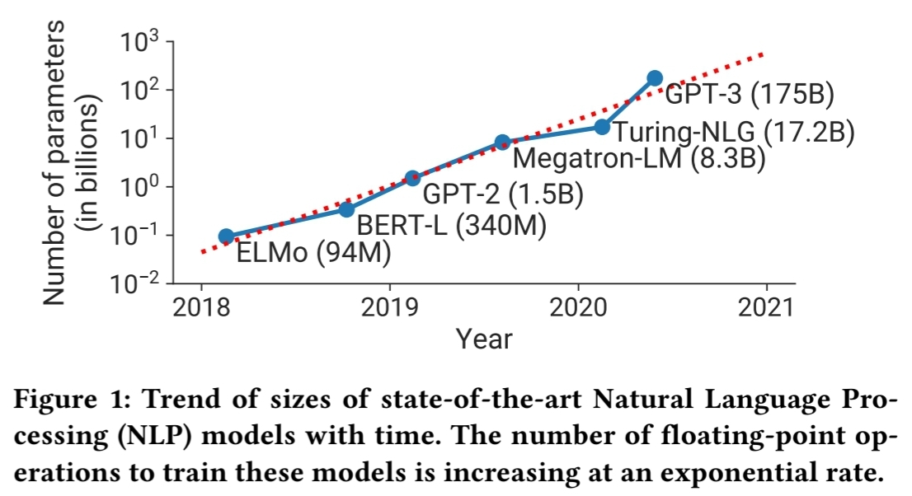
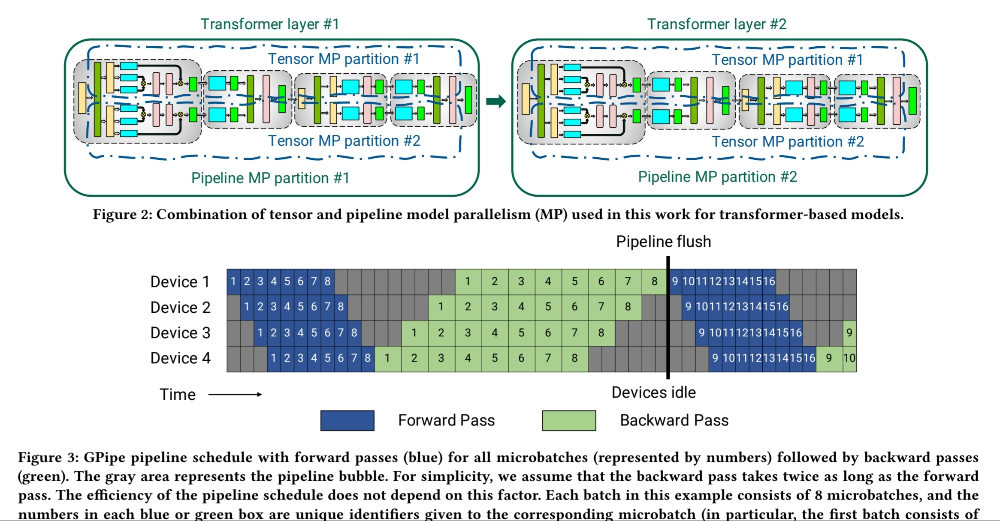
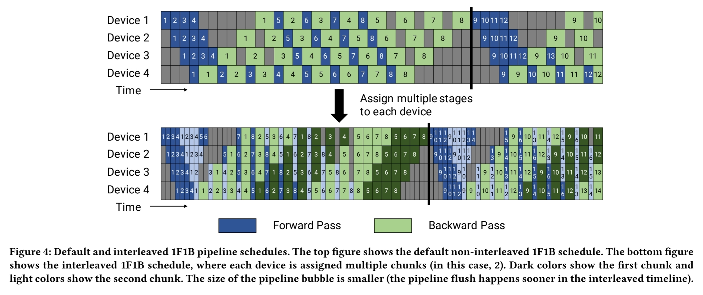
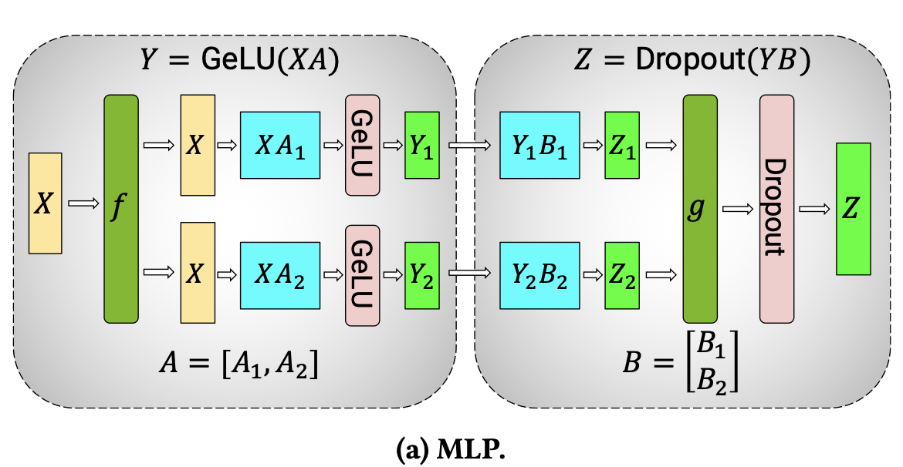
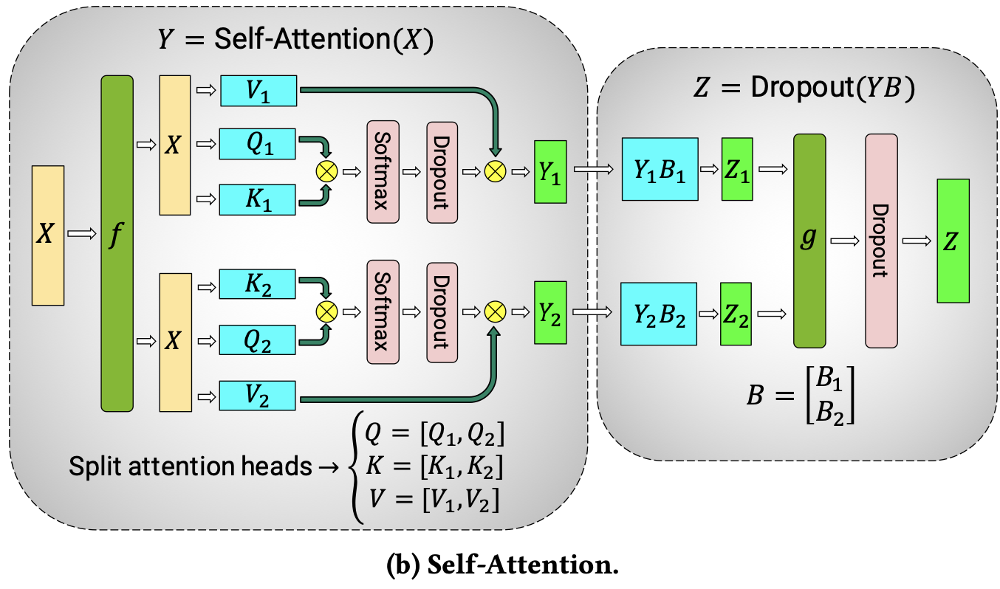
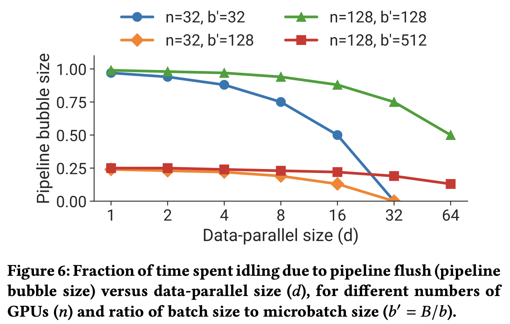

[Megatron-LM: Efficient Large-Scale Language Model Training on GPU Clusters](https://arxiv.org/pdf/2104.04473)

# Overview

이 논문에서는 LLM model이 점점 커지면서, GPU 메모리 제한 때문에 다중 GPU 서버를 쓰더라도 model을 구동할 수 없고, 

training에 필요한 시간이 길어지는 문제를 해결하기 위해서 등장한 tensor 및 pipeline parallelis에서

발생할 수 있는 GPU scaling 문제를 해결하기 위한 방안을 보여주고 있습니다. 

논문이 나온지 좀 되어서, GPU 메모리 제한에 대해 언급한 모델은 A100 이긴 하지만, 

현재 사용한 가능한 H100 역시 80GB memory를 가지고 있으며, model parameter는 점점 더 커지고 있기 때문에, 

문제는 여전히 계속되고 있다고 볼 수 있습니다. 

단일 V100으로 GPT3 (1750억 개의 parameter) 구동하기 위해 

host와 device memory 간의 parameter swap을 이용하고, training 시 288년 소요 된다고 하네요. 😀 

host와 device memory 간 parameter 또는 tensor swap 관련해서 궁금한 부분이 있었는데 관련 논문도 추후 리뷰해 보겠습니다. ([ZeRO-Offload: Democratizing Billion-Scale Model Training](https://arxiv.org/abs/2101.06840))

## 문제점

그래서 더 큰 모델을 구동하기 위해서는 여러 GPU 서버에 분할을 하게 되는데, 논문에서는 2가지 문제점에 대해서 언급하고 있습니다. 

먼저 다중 서버를 사용하게 되면 tensor parallelism 처리에 필요한 all-reduce communication시 NVLink 보다 훨씬 느린 서버간 통신 링크를 사용해야 한다는 것입니다. 

tensor parallelism은 간단하게 생각하면 model의 tensor를 여러 GPU에 나눠서 병렬로 연산을 처리하는 방식으로, 각각의 GPU가 연산한 결과를 다시 모으는 과정이 필요합니다. 

이 때 사용되는 방법이 all-reduce라는 통신 기법입니다. 각 GPU가 계산한 "부분" 결과를 다른 GPU들과 "공유"하여 최종 결과를 만들어 내는 방식이기 때문에,

많은 양의 데이터가 GPU간 전송되어야 합니다. 

이 때 단일 서버 내의 여러 GPU 간의 통신은 NVLink를 사용하게 되면 매우 빠르게 통신할 수 있게 되는 것이지만, 

서버간 통신을 해야 할 때는 서버 간 네트워크를 통해야 합니다. 보통 Ethernet 또는 InfiniBand를 사용하게 되겠죠. 

NVLink와 Ethernet, InfiniBand의 bandwidth 비교는 다음과 같습니다. NVLink 최신 기준으로는 이 차이가 더 많이 나겠죠..

Technology        | Bandwidth (GB/s)
------------------|-----------------
NVLink            | 600.000
Ethernet (1G)     | 0.125
Ethernet (10G)    | 1.250
Ethernet (100G)   | 12.500
InfiniBand (EDR)  | 25.000
InfiniBand (HDR)  | 50.000

두 번째로는, high degree of model parallelism은 small GEMMs 연산을 생성하면서 GPU utilization을 떨어 뜨릴 수 있다는 것입니다. 

model parallelism은 model의 각 부분을 각각의 GPU가 나눠서 담당하게 되는 방식인데, 이 경우 GPU가 상대적으로 큰 연산 대신 작은 연산 (작은 규모의 행렬 곱셈)을 수행하게 됩니다. 

GPU의 구조상 대규모 병렬 연산에 최적화 되어 있기 때문에, GPU의 many core를 최대한으로 활용하지 못하는 small 연산을 처리하게 되면 GPU utilization이 떨어지게 되는 것이죠. 

## Pipeline parallelism

Pipeline parallelism에 대해 간단하게 알아 보겠습니다. 

pipeline parallelism은 model의 layer가 여러 GPU에 분산되어 있고, batch를 "micro-batch"로 분할하고 pipeline화 하는 것입니다. 

따라서 layer를 GPU에 할당하는 방식과, 데이터를 처리하는 scheduling에 따라 성능이 달라질 수 있는 것이고, 논문에서는 forward와 backward pass를 처리하는 방식이 

scheudling 전략에 따라 성능에 영향을 미친다고 합니다. 그리고 이러한 forward/backward pass는 병렬로 처리 될 수 있지만, 각 GPU에서 model parameter를 업데이트 할 때

일관된 값을 사용해야 하기 때문에, 모든 연산이 끝날 때 동기화 (pipeline flush)가 필요합니다. 

이 과정에서는 새로운 micro-batch가 주입되지 않기 때문에, pipeline utilization을 저하시키게 됩니다. 

pipeline flush 시간에 영향을 미치는 중요한 것은 바로, micro-batch와 pipeline 크기의 비율입니다. 효율성을 높이기 위해서는 큰 batch를 사용하는 것이 필요한데,

이 논문에서는 작은 batch 크기에서도 효율을 개선하는 새로운 pipeline scheduling 방법을 도입했다고 하네요.

## Pipeline flush

Pipeline flush는 위에서 설명한 것처럼, pipeline model parallelism에서 batch가 처리되는 동안 모든 micro-batch가 완료 될 때까지 대기하는 과정입니다. 

논문에서는 pipeline이 병렬로 작업을 처리하는 동안, 연산이 끝날 때까지 기다리는 시간이 전체 연산 시간의 50%까지도 소요될 수 있다고 하고 있습니다. 

### Micro-batch와 pipeline 크기의 비율

Micro-batch 수와 pipeline 크기의 비율이 pipeline flush 시간에 영향을 미치게 되는데, micro-batch의 수가 많고, pipeline 크기 (layer 수)에 비해 비율이 크면, 

각 GPU는 더 자주 새로운 작업을 받기 때문에, 대기 시간이 줄어 들고, flush 시간도 줄어듭니다. 병렬 처리 효율성이 좋아지는 것이죠. 

### 큰 batch 크기?

효율성을 높이기 위해 더 큰 batch가 필요한 이유는, batch 크기가 커질 수록 더 많은 micro-batch를 pipeline에 주입할 수 있기 때문입니다. 

micro-batch가 큰 batch를 나누어 작은 단위로 처리하는 데이터 묶음이니까요. 

반대로 말하면, 작은 batch를 사용하게 되면 각 GPU는 작업을 빨리 마치고 다음 작업을 하기 위해 대기하는 시간이 길어 질 수 있게 됩니다. 

## Question

이 논문에서의 insight는 다음과 같습니다. 

대규모 모델을 학습할 때 다양한 기법(data/tensor/pipeline/model parallelism)을 조합해서 사용할 수 있는데, 각각의 기법은 서로 다른 trade off가 있기 때문에,

각 기법의 상호작용을 신중하게 분석해야 성능 최적화를 할 수 있다는 것입니다. 어떻게 이 기법들을 결합해야 대규모 모델의 학습 처리량을 극대화하고, 

동시에 optimizer의 일관성을 유지 할 수 있는가에 대해서 잘 설명해주고 있는 것이죠. 

논문에서의 핵심 질문은 다음과 같습니다. 

> "대규모 모델을 학습할 때, 주어진 배치 크기에서 병렬화 기법을 어떻게 결합해야 throughput을 최대화 하면서도 optimizer의 일관성을 유지할 수 있을까?"

## PTD-P

논문에서는 pipeline, tensor, data parallelism을 결합하여, 수천 개의 GPU에서 대규모 언어 모델을 효과적으로 학습하는 방법에 대해 설명하고 있습니다. 

GPT model (1조개의 parameter)을 기존 ZeRO-3와 같은 기법보다 효율적으로 학습한 성능 결과를 보여주고 있네요. (70% 더 높은 성능!)

ZeRO3의 경우에는 메모리 절약을 위해 parameter를 분할 처리 하는데, model 크기가 커지게 되면 PTD-P 방식의 성능이 더 좋아집니다. 

또한 GPU 추가에 따른 성능이 (거의) 선형으로 확장된다는 것도 장점이네요. 

GPT model을 3072개의 A100 GPU에서 3개월 정도 학습하였으며, GPU당 163 teraFLOP/s, 총 처리량은 502 petaFLOP/s 였다고 합니다. 👍

## Megatron-LM

Megatron-LM에 대한 소개도 살짝 하고 있네요. 대규모 NLP 학습의 성능 최적화를 위해서는 계산 작업을 memory-bound가 아닌 compute-bound로 만들고,

통신 최적화, 효율적인 자원활용을 통해 성능 극대화를 해야 한다고 하고 있습니다. 

# Model Parallelism

### Data Parallelism

Data parallelism은 각 GPU가 model의 전체 복사본을 가지고 있고, input data set이 여러 GPU에 분할(shard)되어 제공됩니다. 

각 GPU는 독립적으로 모델을 학습하고, 주기적으로 gradient를 집계하여, 모든 GPU가 일관적된 weight을 볼 수 있도록 합니다. 

각 모델의 복사본이 각각의 GPU에 올라가는데, 대규모 모델에 이 data parallelism을 어떻게 적용할 수 있을까요?

이 경우에는 작은 model 조각 (shard), 즉 model의 일부만 각 GPU에 복사해서 처리할 수 있습니다. 

즉, data parallelism의 중요한 개념은 각 GPU가 동일한 모델을 갖고 동작한다는 것 보다는, 각 GPU가 동일한 데이터 분할 방식을 적용하고, 동일한 학습 과정을 수행한다는 것이 되겠네요. 

### Async? / Sync?

PipeMare, PipeDream, PipeDream-2BW와 같은 비동기 및 제한된 스테일니스(bounded-staleness) 방식은 pipeline flush를 없애고, 

대신 weight 업데이트의 일관성(semantics)을 완화하여 성능을 향상시키는 방법들이지만, 이러한 방식은 현재 고려하지 않고, 향후 연구에서 다룰 것이라고 언급하고 있습니다.

### Combination of tensor and pipeline model parallelism

위 그림에서 transformer layer1과 layer2는 각각 pipeline parallelism에 의해 여러 **pipeline MP partition**으로 나뉘어져 있습니다. 

각 pipeline 분할 내에서는 tensor parallelism이 적용되어 **tensor MP partion**으로 model이 나뉘어져 있네요. 

개별 GPU는 tensor의 일부만 처리하게 되어 메모리 사용량이 줄어들고 병렬처리가 가능한 구조입니다. 

Fig.3에서는 [GPipe](https://dl.acm.org/doi/abs/10.5555/3454287.3454297)라는 스케줄링 방식을 통해 **micro-batch**가 각 GPU에서 처리되는 방식과 그 과정에서 발생하는 **pipeline bubble**을 보여주고 있습니다. 

각 숫자는 micro-batch를 나타내고, 각 GPU가 서로 다른 micro-batch를 처리하고 있음을 보여주고 있습니다.

회색 부분이 pipeline bubble로, device들이 idle로 있는 시간을 나타냅니다. 

그림에서 보면, forward pass가 끝난 후, backward pass가 시작되기 전에 pipeline bubble이 발생하고 있네요. 

이 시간을 가능한 최소화하면 학습 속도를 향상 시킬 수 있게 되겠네요.

이 그림에서는 1 forward pass와 1 backword pass의 pipeline schedule에서 기본 schedule과 interleaved schedule을 비교 하고 있습니다. 

default schedule(Gpipe)에서는 각 GPU가 순차적으로 forward pass와 backward pass를 실행합니다. 

device 1에서부터 4까지 각 device가 작업을 수행한 후, 다음 device가 해당 작업을 이어서 수행하고 있습니다. 

각 device는 하나의 micro-batch를 처리하고 나면, 다음 micro-batch를 처리하기 전까지 idle 상태로 대기합니다. 

즉, **하나의 batch 내 모든 micro-batch의 forward pass가 먼저 실행되고, 이후 모든 micro-batch의 backward pass가 실행**되는 schedule 방식입니다. 

이 default schedule 상황에서는 pipeline flush가 발생했을 때 pipeline bubble이 커지고, 일부 device의 idle 시간이 길어지는 것을 볼 수 있습니다. 

Gpipe에서 pipeline parallelism 처리 시 bubble이 성능에 미치는 영향을 줄이기 위해서는 micro-batch의 수(𝑚)가 파이프라인 단계 수(𝑝)보다 훨씬 많아야 한다고 말하고 있습니다.  

pipeline bubble을 𝑡𝑝𝑏, 이상적인 반복당 시간을 𝑡𝑖𝑑, 그리고 단일 micro-batch의 forward pass와 backward pass를 실행하는 데 걸리는 시간을 각각 𝑡𝑓와 𝑡𝑏라고 할 때, 

이 schedule에서 pipeline bubble은 batch의 시작에서 𝑝 − 1개의 forward pass와 batch의 끝에서 𝑝 − 1개의 backward pass로 구성됩니다.

그림에서 좀 더 자세히 보면, 하나의 배치가 처리되는 동안 발생하는 bubble 구간은 총 3곳 입니다. 

1번 구간을 보면, 1개의 forward pass가 수행되는 시간은 1 time (박스 1개) 이고, 모든 device가 forward pass를 시작하기까지 걸리는 시간이 총 3 time입니다. 

즉 device 개수 (p - 1) time 만큼, backward pass pipeline이 시작되기 전에 device들이 idle 상태로 대기하는 구간이 발생하는 것입니다. 

2번 구간은 2개의 idle 구간이 발생하는데, 모든 device에서 forward pass가 완료되고 나서, device 4에서 backward pass를 시작하기 까지 걸리는 시간 (3 time)과, 

모든 device에서 backward pass pipeline 시작이 완료되는 시간까지 걸리는 시간 (2 time * 3)입니다. 

논문에서 backward pass의 시간을 2 * forward pass라고 하고, pipeline 효율성이 이 시간 비율에는 의존하지 않는다고 한 부분 참고하세요.

3번 구간은 backward pass가 모두 완료되고, 다음 batch가 시작되기 전까지의 시간을 나타내고 있습니다. 이 때에도 마찬가지로 (p - 1) time 만큼의 idle 시간이 발생합니다. 

따라서 batch에 대한 이상적인 처리 시간은 **𝑡𝑖𝑑 = 𝑚·(𝑡𝑓 + 𝑡𝑏)**이 되는 것입니다. 

다음으로 pipeline bubble에서 소비된 시간이 이상적인 계산 시간에 차지하는 비율을 살펴보겠습니다.

pipeline bubble에 소비된 총 시간은 **𝑡𝑝𝑏 = (𝑝−1)·(𝑡𝑓 + 𝑡𝑏)**로 나타낼 수 있습니다.

그렇기 때문에, 아래와 같이 말할 수 있게 됩니다. 

The bubble time fraction is:

$$
\text{Bubble time fraction} = \frac{t_{pb}}{t_{id}} = \frac{(p - 1) \cdot (t_f + t_b)}{m \cdot (t_f + t_b)} = \frac{p - 1}{m}
$$

따라서 bubble time을 줄이려면, micro-batch의 수를 늘리거나, pipeline 단계를 최적화하는 것이 필요하겠죠. 

micro-batch의 수가 많아지게 되면, pipeline이 효율적으로 채워지면서 bubble이 줄어 들 수 있지만, 반대로 pipeline 단계를 너무 많게 만들면 비효율적인 bubble이 발생할 수 있습니다. 

따라서 pipeline bubble의 시간이 작아지려면 𝑚 ≫ 𝑝이어야 하는데요, 논문에서는 이렇게 언급하고 있습니다. 

𝑚이 너무 커지게 되면, 즉 micro-batch의 수가 너무 많아지게되면, 메모리 사용량이 크게 늘어날 수 있습니다. 

모든 micro-batch에 대해서 intermediate activations 같은 값들을 모드 memory에 저장해야 하기 때문입니다. 

이 그림의 위쪽에서는, [PipeDream-Flush](https://arxiv.org/abs/2006.09503) 스케줄을 사용한 것을 보여주고 있습니다. 

이 스케줄에서는 먼저 device들이 서로 다른 횟수의 forward pass를 수행하는 워밍업 단계를 거치며

활성화 값을 유지해야 하는 micro-batch(역방향 패스가 완료되지 않아 활성화 값을 유지해야 하는 micro-batch)의 수를 

pipeline의 depth만큼으로 제한합니다.

워밍업 단계가 끝난 후, 각 device는 forward pass 하나와 backward pass 하나를 수행하는 안정 상태에 들어갑니다 (1F1B).

batch가 끝나면 남은 모든 micro-batch에 대한 backward pass를 완료합니다.

이 새로운 schedule에서 bubble에 소비되는 시간은 동일하지만, forward pass가 미완료된 micro-batch의 수는 pipeline 단계 수만큼으로 제한했기 때문에, 

GPipe schedule과 비교했을 때 활성화 값을 저장해야 하는 micro-batch의 수가 p 개 이하로 줄어들게 되는 것이죠. (GPipe의 경우 마이크로배치 수는  m 개).

따라서 마이크로배치 수가 파이프라인 단계 수보다 훨씬 많을 때, PipeDream-Flush는 GPipe보다 훨씬 메모리 효율적이게 됩니다. 

Fig.4의 아래쪽에서는 **interleaved schedule**에 대해서 보여주고 있습니다. 

pipeline bubble의 크기를 줄이기 위해 각 device가 여러 개의 layer 부분 집합 (model chunk)에 대한 계산을 수행할 수 있습니다. 

일반적으로 한 device에서 layer 1개를 담당하도록 설정했지만, interleaved schedule에서는 각 device가 여러 layer를 처리하게 됩니다.

이렇게 함으로써, 각 device가 여러 pipleline stage에 할당되고, 각 pipeline stage는 이전보다 적은 양의 계산을 수행하게 됩니다. 

논문에서는 **batch 내 micro-batch의 수가 pipeline 단계의 정수 배**가 되어야 한다고 말하고 있는데요, 

이는 모든 device가 동등하게 작업을 나누어 처리하기 위해서입니다. 

모든 작업을 동등하게 나누지 않으면, 처리할 작업이 없는 device가 발생하고, 대기 시간이 발생하기 때문입니다. 

이 schedule 방식의 단점도 함께 언급하고 있습니다. 

pipeline bubble을 줄이는 대신 trade off로 통신량이 증가하게 되는 문제가 발생한다는 것입니다. 

## Tensor Parallelism

Tensor parallelism은 model의 각 layer가 여러 device에 걸쳐 분할됩니다. 

Transformer layer는 self-attention과 2층의 mlp(multi-layer perceptron)으로 구성되어 있는데, ([Attention is All You Need](https://arxiv.org/abs/1706.03762))

MLP block의 구조를 보면, 2개의 GEMM(General Matrix Multiplication) 연산과 GeLU(Gaussian Error Linear Unit) 비선형 활성화 함수로 구성되어 있습니다.

$$
Y = \text{GeLU}(X A)
$$

$$
Z = \text{Dropout}(Y B)
$$

이 MLP block의 연산 과정 Y = GeLU(XA)을 보면, X는 입력, A는 가중치 행렬입니다. 

두 번째 Z = Dropout(YB)에서, Y는 첫 번째 단계의 출력, B는 두 번째 가중치 행렬이 됩니다. (Dropout은 과적합을 방지하기 위해 사용)

여기에서, 가중치 행렬 A를 열 방향으로 두 부분으로 나누면, A = [A1, A2]가 됩니다.

이렇게 나누게되면, GeLU 함수를 각 분할된 GEMM 연산의 출력에 독립적으로 적용할 수 있게 되는 것인데, 즉 A1과 A2에 대한 연산을 동시에 수행할 수 있게 되는 것입니다.

위 그림처럼 병렬 수행이 가능해 지는 것이죠. 이 말은 연산 뿐 아니라, 가중치 행렬 A가 매우 큰 경우, 이를 여러 장치에 분산 시켜 메모리 사용 또한 최적화 할 수 있다는 것입니다. 

가중치 행렬 A를 행 방향으로 나누게 되면, GeLU 함수가 비선형 함수이기 때문에 동기화가 필요하게 되는데, 이를 열 방향으로 나누게 되면서 동기화가 필요 없어집니다. 

반대로 가중치 행렬 B는 행 방향으로 나누어서, GEMM 연산을 병렬로 수행하면서, 동기화가 필요 없어지게 되는 것이죠.

이 부분에 대해서 간단하게 좀 더 살펴 보겠습니다. 

### GeLU (Gaussian Error Linear Unit)

GeLU는 비선형 활성화 함수로, 입력을 단순히 선형 변환하지 않고 비선형적으로 변환합니다. 

쉽게 생각하면, transformer에서 GeLU 함수는 self-attention과 mlp 연산 사이에 위치하게 되는데, model이 입력 데이터를 좀 더 잘 처리할 수 있도록 해줍니다. 😀

활성화 함수라는 의미는, 인공지능 모델이 데이터를 처리하는 도중 결과를 조정하는 도구라고 생각하면 되는데요. 

어떤 숫자를 넣으면 그 숫자를 단순히 그대로 사용하는 게 아니라, 특정한 규칙에 따라 변형해서 모델의 성능을 높이는 역할을 합니다. 

즉 GeLU 함수는 입력값을 받아서, 특정한 규칙(약간의 랜덤성?)에 따라 변형해서 출력값을 만들어 내는 것이죠.

예를 들어, GeLU는 어떤 입력 값이 들어오면 그 값을 약간 변화시켜, **필요한 값만 남기고 나머지는 무시**하는 방식으로 작동합니다.

어떤 숫자(데이터)가 5라고 할 때, GeLU는 이 5를 그대로 사용하지 않고, 그 숫자가 유용하다고 판단하면 조금 더 큰 값으로 변형하거나, 덜 유용하다고 판단하면 약간 줄인 값을 출력합니다. 

즉, 숫자를 단순히 통과시키지 않고 그 값의 중요성에 따라 변형하는 것이죠. 

### Transformer weight matrix

가중치 행렬을 열 단위로 분산하게 되면 동기화가 필요 없다는 말은, 열 단위로는 각각 영향을 주지 않는다는 것인데요. 

transformer의 가중치 행렬은 간단하게 생각하면, 다음과 같이 구성됩니다. 

행(row)은 입력 데이터의 **특성(feature)**에 대응합니다. 

예를 들어, 입력 데이터가 512차원의 임베딩 벡터라면, 가중치 행렬의 512개의 행이 각각 입력 벡터의 특성(예: 각 단어의 의미적인 정보)을 변환하는 역할을 합니다.

열(column)은 출력되는 새로운 특성에 대응합니다. 행렬 곱 연산을 통해, 입력 벡터의 특성들이 가중치 행렬의 열을 통해 결합되어 새로운 출력 벡터를 형성합니다.

따라서 각 열은 독립적인 출력을 나타내므로, 각 열을 나누어 계산할 수 있습니다. 

출력된 새로운 특성들이 독립적으로 처리되므로 동기화가 필요 없습니다.

하지만 행을 나누면, 입력 벡터의 각 특성이 서로 상호작용할 가능성이 있기 때문에, 병렬로 처리할 때 동기화가 필요할 수 있습니다. 

행 단위로 나눌 경우, 입력 데이터를 다시 합쳐서 계산해야 할 수도 있기 때문에 처리 과정이 복잡해질 수 있다는 것입니다. 

### GEMM (General Matrix Multiply)

GEMM은 간단하게 말하면, 행렬 곱셈 연산을 의미합니다.

위 그림에서 보면, 가중치 행렬 B를 행방향으로 나누어서 처리하고 있는데, 

위에서 설명한 것처럼 가중치 행렬의 구조가 행 방향으로는 관련이 있는 데이터이고, 이 데이터들은 연속적으로 저장되어 있기 때문에,

메모리에서 한 번에 행 단위로 "연속적으로" 읽어와서 처리할 수 있게 됩니다.

따라서 행 단위로 나누어 연산을 처리하는 것이 효율적이라고 할 수 있습니다.

### Self-Attention

self attention 때에도 마찬가지로 생각할 수 있겠습니다. 

Key, Query, Value 행렬은 열 단위로 나누어 GPU가 병렬로 데이터를 효율적으로 처리할 수 있고, 

output linear layer에서는 행 단위로 나누어 처리됩니다. 

이렇게 하면 attention 연산의 결과를 결합할 때 각 GPU가 독립적으로 작업을 나누어 처리할 수 있습니다.

논문에서는 여러 GPU에서 각각 나누어 계산한 결과를 합쳐서 하나로 만드는 과정인 all-reduce 연산은 몇 줄의 코드로 간단하게 구현할 수 있다고 합니다.

# PERFORMANCE ANALYSIS OF PARALLELIZATION CONFIGURATIONS

transformer model을 훈련할 때, 여러 가지 병렬 처리 방식을 결합할 수 있는데 여기서는 pipeline/tensor/data parallelism이라는 세 가지 주요 병렬 처리 방식을 결합하는 방법에 대해 설명하고 있습니다. 

중요한 점은 사용할 수 있는 자원, 즉 GPU 수와 **배치 크기(batch size)**가 정해져 있다는 점입니다. 

또한 각 병렬 처리 방식에는 메모리 사용량(memory footprint), device utilization, 그리고 통신량 사이에서 trade off가 있습니다. 

## Notation

논문에서는 다음과 같이 notation을 정의하고 있습니다.

	• p, t, d 는 각각 pipeline 병렬 처리, tensor 모델 병렬 처리, data 병렬 처리 크기를 나타냅니다.
	• n 은 총 GPU의 수로, p \cdot t \cdot d 와 같습니다.
	• B 는 글로벌 batch 크기이고, b는 micro-batch 크기입니다.
	• m 은 pipeline에서 한 배치가 몇 개의 micro-batch로 나뉘는지를 나타냅니다.

## Tensor and Pipeline Model Parallelism

이 그림에서는 pipeline bubble 크기와 데이터 병렬 처리 크기(𝑑) 간의 관계를 설명하고 있습니다. 

그래프는 **GPU 수(𝑛)**와 **배치 크기와 마이크로배치 크기의 비율(𝑏’ = B/b)**가 다를 때, 데이터 병렬 처리 크기가 어떻게 파이프라인 버블 크기에 영향을 미치는지를 보여줍니다.

x축은 **데이터 병렬 처리 크기(𝑑)**를 나타냅니다. d가 커질수록, 더 많은 GPU들이 같은 모델을 복사하여 각기 다른 데이터 조각을 병렬로 처리하게 됩니다.

y축은 pipeline bubble 크기를 나타냅니다. 이 값은 pipeline 병렬 처리 중에 발생하는 GPU의 idle 시간 비율을 의미합니다.

이 값이 클수록 GPU들이 대기하는 시간이 많다는 뜻입니다.

GPU 수와 마이크로배치 크기에 따른 차이를 보면, n = 32, b{\prime} = 32(파란색 원)과  n = 32, b{\prime} = 128(주황색 마름모)의 경우,

data 병렬 처리 크기 d가 1에서 16으로 커질수록 pipeline bubble 크기가 급격하게 감소하는 것을 볼 수 있습니다. 

n = 128, b{\prime} = 512(빨간색 사각형)의 경우, pipeline bubble 크기가 처음부터 매우 낮고,
 
d가 증가해도 거의 변화가 없습니다. 이는 더 큰 batch 크기와 micro-batch 크기로 설정된 실험에서 pipeline bubble 크기가 이미 최적화되어 있다는 것을 의미합니다.

batch 크기와 micro-batch 크기의 비율도 한 번 살펴 보겠습니다. 

b{\prime} = 32 인 경우(파란색), pipeline bubble 크기가 상대적으로 더 큽니다. 이는 작은 batch 크기에서는 GPU가 더 자주 대기 상태에 놓이기 때문입니다.

b{\prime} = 512 인 경우(빨간색), pipeline bubble 크기가 매우 작으며 data 병렬 처리 크기 증가에 따른 차이가 거의 없습니다.

이는 큰 batch 크기에서 GPU가 더 효율적으로 활용된다는 것을 보여줍니다. 

batch 크기가 커지면, pipeline 병렬 처리로 인한 대기 시간과, 데이터 병렬 처리에서 필요한 All-Reduce 통신 빈도는 줄어듭니다. 

또한 각 GPU가 더 많은 데이터를 처리하기 때문에, GPU 간 통신이 더 간헐적으로 이루어집니다. 결과적으로, 통신에 소비되는 시간이 줄어들게 되는 것입니다. 

## Activation recomputation

**Activation recomputation(활성화 재계산)**은 메모리 사용량을 줄이기 위한 기법으로, 

모델이 첫 번째 forward pass를 한 번 실행하게 되면, **중간 활성화 값(activation, 각 층을 지나면서 계산되는 값)**을 메모리에 저장하고, 이를 backward pass에 사용합니다.

이 기법에서는 이 대신에, forward pass를 한 번 더 실행하여, backward pass를 수행할 때 필요한 중간 활성화 값을 다시 계산하는 방식을 사용합니다. 

메모리 사용량을 줄이는 대신, 계산량이 늘어나게 되는데요, 이를 통해 메모리 사용량과 계산량 사이의 trade off를 조절할 수 있겠네요.

## Activation checkpoint

Activation checkpoint는 모델 훈련 중에 중간 활성화 값을 저장하는 지점을 말합니다.

activation checkpoint를 적게 설정하면 메모리 사용량이 줄어들지만, 필요할 때 다시 계산해야 하기 때문에 계산량이 늘어납니다.

반대로 체크포인트가 많으면 중간 값을 자주 저장하므로 메모리는 많이 쓰이지만, 계산량은 줄어듭니다.

activation checkpoint 수는 처리량에는 영향을 미치지 않습니다. 즉, GPU가 얼마나 빠르게 데이터를 처리하느냐는 activatoin checkpoint 수에 큰 영향을 받지 않는다는 뜻입니다.

## Activation Partitioning

Activation partitioning은 **중간 활성화 값(activation)**을 여러 GPU에 나누어 저장하는 기법입니다.

즉, 각 GPU가 전체 활성화 값을 저장하는 대신, 그 값들을 분할하여 서로 다른 GPU에 나누어 저장함으로써 메모리 사용량을 줄이는 방법입니다.

Tensor 모델 병렬 처리를 사용하는 경우에도 이 활성화 값으로 인해 여전히 메모리 문제가 발생할 수 있습니다.

이때, 활성화 파티셔닝을 사용하면 활성화 값을 여러 GPU에 분산 저장할 수 있으므로, 텐서 모델 병렬 처리와 결합해 메모리 사용량을 줄일 수 있습니다.

# IMPLEMENTATION

Megatron-LM을 어떻게 구현했는지에 대한 내용도 살펴 보겠습니다. 

PTD-P(Pipeline, Tensor, and Data Parallelism)라는 병렬 처리 방식을 Megatron-LM 코드베이스에 확장하여 구현하였고, 

이 구현은 PyTorch를 사용하고, GPU 간의 통신을 위해 NCCL(NVIDIA Collective Communications Library)을 사용했으며, 통신과 계산 성능을 최적화하기 위해 다양한 기법을 적용했음을 언급하고 있습니다. 

여기서 통신 최적화는 NCCL을 통한 효율적인 GPU 간 데이터 전송을 의미하며, 계산 최적화는 모델 병렬 처리 및 파이프라인 병렬 처리의 효율적인 분배를 의미합니다. 

통신 최적화를 어떻게 했는지 부터 살펴 보겠습니다. 

## Communication Optimizations

논문 실험에서는 DGX A100 서버를 사용했는데, DGX A100 서버는 8개의 InfiniBand(IB) 네트워크 카드를 탑재하고 있습니다. 

InfiniBand는 고속 데이터 전송을 지원하는 네트워크 기술로, GPU 간 빠른 데이터 통신을 가능하게 해주는데, 이론적으로는 이 8개의 네트워크 카드를 활용해 병렬로 여러 데이터 전송 작업을 수행할 수 있을 것으로 기대할 수 있겠죠.

pipeline 병렬 처리에서는 forward/backward 연산 모두에서 GPU 간에 **텐서(tensor)**를 전송하고 받아야 하는데, 이 전송이 병렬로 이루어져야 성능이 최적화됩니다. 

즉, 데이터를 한 방향으로 보내는 동안, 다른 방향으로도 동시에 데이터를 주고받아야 GPU 간 대기 시간을 줄일 수 있게 되는 것입니다. 

그런데 말입니다. 

Tensor 전송은 point-to-point 방식으로 이루어집니다. 이는 한 쌍의 GPU가 서로 데이터를 주고받는 방식으로, **각 통신이 GPU 두 대 사이에서만 발생**한다는 의미입니다.

따라서, 하나의 통신 요청에서 8개의 InfiniBand 카드를 모두 활용하는 것이 어렵습니다. 

이어서 업데이트. 
