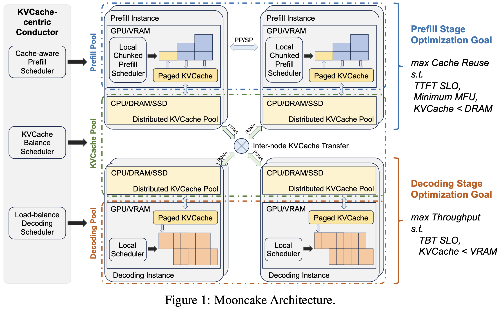

[Mooncake: A KVCache-centric Disaggregated Architecture for LLM Serving](https://arxiv.org/abs/2407.00079)
[Mooncacke github](https://github.com/kvcache-ai/Mooncake)

Mooncake는 KVCache 중심의 분산형 아키텍처로, 자원 사용 최적화와 처리량 개선을 목표로 하는 Kimi(Moonshot AI에서 제공하는 LLM service, MaaS)의 serving platform입니다. 

LLM service가 다양해지면서, workload 역시 다양해지고, 서비스 수준 목표 (SLO) 역시 다양해지고 있는데, 

Kimi의 주요 목표 중 하나는 (수익성 증대를 위해!) 전체 유효 처리량을 극대화하는 것이며, 

이 과정의 SLO는 주로 첫 번째 토큰 생성 시간(TTFT)과 토큰 간 시간(TBT)을 포함하는 지연 관련 요구 사항을 충족하는 것을 포함하고 있습니다. 

Mooncake는 두 가지 주요 기능을 제공합니다. 첫째, Mooncake는 클러스터를 두 부분으로 분리하는데, 

- prefill 클러스터는 미리 계산된 토큰을 저장하고,
- 디코딩 클러스터는 토큰을 디코딩합니다.

두 번째로, Mooncake는 GPU 클러스터의 미사용 CPU, DRAM, SSD 자원을 활용해 분산형 KVCache를 구현합니다.

Mooncake의 핵심은 KVCache centric scheduler로, 전체 처리량을 극대화하면서도 지연 관련 SLO를 충족시킵니다.

이 architecture는 특히 긴 문맥 처리에 강점을 가지며, 기존 방법에 비해 처리량을 최대 525% 향상시키고, 실제 워크로드에서 75% 더 많은 요청을 처리할 수 있다고 하네요.

어떤 아이디어로 시작했는지, 어떤 문제를 해결하고자 했는지, 어떤 결과를 얻었는지, 좀 더 자세히 살펴보겠습니다.

논문에서는 전체 처리량 극대화를 위해서는 GPU cluster 내의 다양한 resource를 최적으로 활용해야 한다고 말하고 있습니다. 

GPU 서버를 분산 resource pool로 분리하고 재구성해서, 각 pool은 다른 목표에 최적화 되어 있으면서도 서로 협력하도록 하는 것이 필요하다고 합니다.

LLM 서비스의 두 단계인 prefill과 decoding 단계가 매우 다른 계산 특성을 가지기 때문에, 많은 연구에서 prefill 서버와 decoding 서버를 분리하는 것을 제안하고 있습니다.

Request가 prefill 서버에서 decoding 서버로 전송될 때, KVCache가 전환되어야 하는데, 이는 전체 시스템의 성능에 영향을 미칠 수 있기 때문입니다. 

왜냐면 원격 위치에서 KVCache를 재사용하면 첫 번째 토큰 생성 시간(TTFT)이 길어지고, 큰 batch 크기는 토큰 간 시간(TBT)을 증가시킬 수 있기 때문에,

이러한 처리량 중심의 최적화 방법들을 모두 활용하는 것은 latency 관련 SLO를 충족시키기 어렵다는 말이죠. 

Mooncake는 결국 KVCache 스케줄링이 LLM 스케줄링의 핵심이므로, KVCache centric scheduler를 사용하여 전체 시스템의 성능을 극대화했다고 합니다. 

어떻게 이것을 가능하게 했는지, architecture에 대해 좀 더 살펴 보겠습니다. 

## Mooncake - KVCache centric disaggregated architecture

논문에서는 Mooncake의 아키텍처에 대해 먼저 이렇게 말합니다. 

> "스케줄링과 최적화를 위해 KVCache를 중심으로 한 분산형 설계를 제안한다"

위 그림이 논문에서 설명하는 KVCache centric 분산형 아키텍처이고, 

그림의 중앙 부분을 보면, 크게 3 부분으로 나뉘어져 있습니다. Prefill pool, Decoding pool, KVCache pool입니다.

### Prefill pool

Prefill pool은 미리 계산된 토큰을 저장하는 역할을 하며, prefill instance들로 구성됩니다.

prefill instance는 Prefill을 위해 GPU/VRAM을 사용하고, local chunk scheduler가 KVCache를 페이지 방식으로 관리하며, max cache reuse가 목표입니다.

### Decoding pool

Decoding pool은 디코딩을 담당하는 instacne들로 구성됩니다.

이들은 local scheduler를 통해 max throughput을 목표로 작동하며, KVCache는 VRAM 내에서 관리됩니다.

### KVCache pool

모든 instacne는 CPU, DRAM, SSD를 사용하여 distributed KVCache pool을 관리합니다. 

이 풀은 노드 간 KVCache 전송을 통해 연결되어 있네요. 

### Conductor

그림의 왼쪽 부분에는 Conductor라는 것이 있는데, 이는 전체 시스템을 관리하고, 요청을 스케줄링하는 역할을 합니다.

논문에서는 Conductor의 동작을 다음과 같이 설명하고 있습니다. 

각 요청에 대해, conductor는 다음과 같은 단계로 prefill 및 디코딩 인스턴스 쌍을 선택하고 요청을 스케줄링합니다. 

1. 선택된 prefill instance로 재사용 가능한 KVCache를 최대한 전송합니다.
2. chunk 또는 layer 단위로 prefill 단계를 완료하고, 출력된 KVCache를 해당 디코딩 인스턴스로 지속적으로 streaming합니다.
3. decoding instance에서 KVCache를 load하고 request를 지속적인 batching process에 추가하여 request 출력을 생성합니다.

이 과정에 대한 어려움은 무엇일까요?

Prefill 단계에서는 중복 계산을 피하기 위해 KVCache를 최대한 재사용해야 합니다. 재사용을 위해서는 KVCache를 DRAM에 저장해야 하지만, DRAM 공간이 부족한 경우 이를 하위 계층 스토리지에 저장해야 합니다.

그러나 하위 계층 스토리지에 저장된 KVCache를 기다리다보면, TTFT SLO를 위반할 수 있습니다. 또한, KVCache 서버에 대한 높은 수요는 네트워크 혼잡을 초래해 대기 시간을 늘릴 수 있습니다.

Mooncake의 conductor는 KVCache 블록의 사용을 예측하고, 이를 기반으로 스왑과 복제 같은 스케줄링 작업을 수행합니다. 

가장 많이 사용되는 블록은 여러 노드에 복제해 혼잡을 피하고, 사용 빈도가 낮은 블록은 비용을 줄이기 위해 스왑 아웃합니다. 

Decoding 단계에서는 MFU(Model FLOPs Utilization)를 최대화하기 위해 가능한 많은 토큰을 집계해야 합니다. 

하지만 이는 TBT(Time Between Tokens) SLO와 VRAM에 저장할 수 있는 총 KVCache 크기에 제한됩니다.

결국 단순히 throughput을 높이는 것뿐만 아니라, 메모리 관리와 지연 시간 간의 균형을 맞춰야 한다는 것이죠. 

현재의 LLM 연구에서는 항상 자원이 충분하다는 것을 가정하고 있기 때문에, 이러한 자원 관리 문제는 무시되고 있는데, 

Mooncake는 특정 쿼리의 생성 길이를 예측하고, 단기적인 전체 부하 예측을 통해 더 나은 rejection policy를 구현하고 있습니다. 

우선순위 기반 스케줄링을 구현하기 위해 다양한 요청의 우선순위를 분류하고, 이를 overload-oriented scheduling으로 요약하고 있습니다. 

